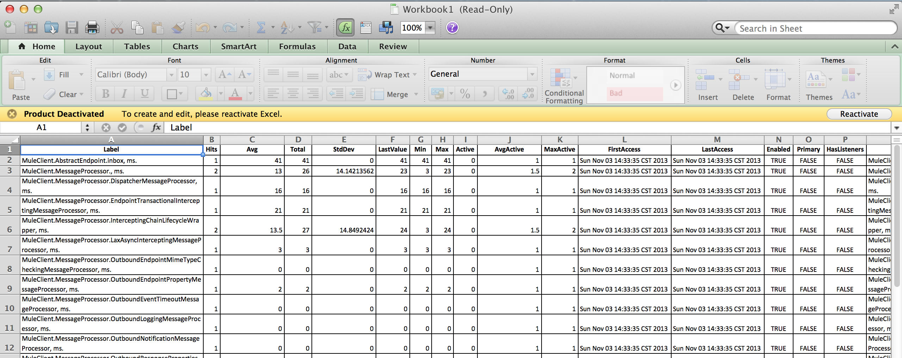

> This documentation is heavily under construction so check back for updates.

# Confluex Performance Tools

Initially, we're providing instrumentation to show visibility into mule message processor (and hopefully other
internals) performance.

# Viewing the Report

> We'll be offering JSON and HTML version of this report. For now, it's just an HTML table dump of statistics
> provided by JAMon's MonitorFactory.getReport. Look for this soon

You can download an Excel report of the performance stats via URL :

http://my.mule.server:9138/performance



# Using the reports in Tests

For now, use the JAMon MonitorFactory. This will likely change in the future as we abstract ourselves from the API.

```groovy
import static com.jamonapi.LogMonitor.*

assert getMonitor("TestPerformanceTools.MessageProcessor.SetPayloadTransformer", "ms.").hits == 10
```

# Maven Configuration

Add the dependency to you pom:

```xml
<dependency>
    <groupId>com.confluex.mule</groupId>
    <artifactId>confluex-performance-tools</artifactId>
    <version>${confluex.labs.version}</version>
</dependency>
```

Add the aspect weaver into the build **if you need to instrument functional test cases**


```xml
<plugin>
    <groupId>org.apache.maven.plugins</groupId>
    <artifactId>maven-surefire-plugin</artifactId>
    <version>2.16</version>
    <configuration>
        <argLine>
            -javaagent:${env.HOME}/.m2/repository/org/aspectj/aspectjweaver/${aspectj.version}/aspectjweaver-${aspectj.version}.jar
        </argLine>
        <systemProperties>
            <property>
                <name>aj.weaving.verbose</name>
                <value>true</value>
            </property>
        </systemProperties>
    </configuration>
</plugin>
```
# Mule Configuration

Bootstrap the mule server with the javaavgent provided by the container:

> Double check the version that is provided with your Mule ditribution

_MULE_HOME/conf/wrapper.conf_

```ini
wrapper.java.additional.<n>=-javaagent:%MULE_HOME%/lib/opt/aspectjweaver-1.6.11.jar
```

If you want access to the HTTP services/resports, you'll need to import the performance.xml flows from one of your
flows:

```xml
    <spring:beans>
        <spring:import resource="classpath:performance.xml"/>
    </spring:beans>
```

# AspectJ Configuration

This module uses AspectJ's load time weaving to instrument the Mule flow internals. You'll need to declare
the dependencies (they're provided with the Mule contain and should be scoped as provided).

> Check your MULE_HOME/lib/opt for the appropriate versions.

__pom.xml__

```xml
    <dependency>
        <groupId>org.aspectj</groupId>
        <artifactId>aspectjrt</artifactId>
        <version>${aspectj.version}</version>
        <scope>provided</scope>
    </dependency>
    <dependency>
        <groupId>org.aspectj</groupId>
        <artifactId>aspectjweaver</artifactId>
        <version>${aspectj.version}</version>
        <scope>provided</scope>
    </dependency>
```

Next, you'll need to create your metadata file for AspectJ which tells it what packages to instrument:

 __META-INF/aop.xml__

```xml
<!DOCTYPE aspectj PUBLIC
        "-//AspectJ//DTD//EN" "http://www.eclipse.org/aspectj/dtd/aspectj.dtd">
<aspectj>
    <weaver options="-showWeaveInfo -debug -verbose -XmessageHandlerClass:org.springframework.aop.aspectj.AspectJWeaverMessageHandler">
        <include within="org.mule..*"/>
        <include within="com.mycompany..*"/>
    </weaver>
    <aspects>
        <aspect name="com.confluex.mule.performance.PerformanceLoggerAspect"/>
        <include within="com.mycompany..*"/>
    </aspects>
</aspectj>
```

In order to apply the aspects, you need to start your java process with a javaagent:


**IDE Integration**

See your IDE documentation for setting test parameters and set the path to the aspectjweaver jar as a -javagent.

